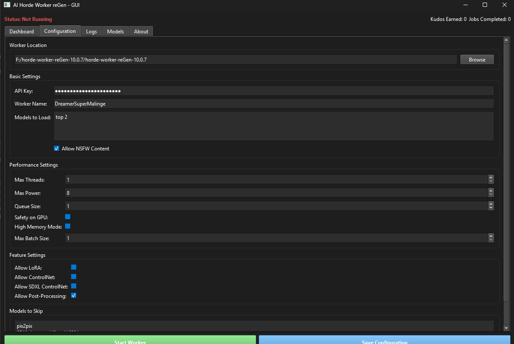

Absolutely, Stephan! Here's a polished and visually structured English README version that includes the image reference:

---

# AI Horde Worker reGen GUI

**A PyQt6 graphical interface for managing and monitoring your AI Horde Worker reGen contribution.**



## ✨ Features

- Easy configuration of worker settings  
- Real-time monitoring of worker status  
- Log viewing and management  
- Statistics tracking  
- Model management  

## 🚀 Installation

1. Ensure Python **3.9+** is installed  
2. Clone this repository  
3. Install dependencies:  
   ```bash
   pip install -r requirements.txt
   ```
4. Launch the app:  
   ```bash
   python run.py
   ```

## 📦 Dependencies

- `PyQt6`  
- `pyyaml`  
- `loguru`  
- `gitpython` *(optional: for update features)*  
- `torchaudio`, `matplotlib`, `tqdm` *(for worker functionality)*  
- `requests` *(for API communication)*  

## ⚙️ Settings

When first launched, the application creates a `settings` directory to store:

- Previously used worker folder  
- Configuration file location  
- UI preferences  

## 📄 License

This project is licensed under the **MIT License** – see the `LICENSE` file for details.

